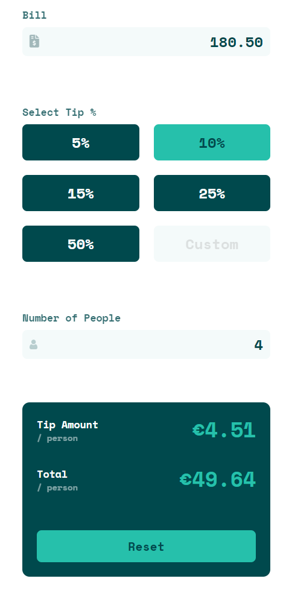
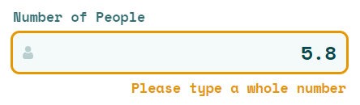

# Tip calculator app

## Table of contents

- [Summary](#summary)
- [Usage](#usage)
- [Built with](#built-with)
- [Live website](#live-website)
- [Installation](#installation)
- [More insights](#more-insights)


## Summary

This project is a solution to the [Tip calculator app challenge on Frontend Mentor](https://www.frontendmentor.io/challenges/tip-calculator-app-ugJNGbJUX). The app allows to calculate:
+ tip amount
+ total bill value

based on three values:

+ bill value
+ tip percentage
+ number of people

**Mobile view:**


**Desktop view:**


## Usage

In order to calculate results, user must provide three values.


In the **Bill** section, enter the bill value, e.g.:


In the **Select Tip %** section, you can choose either predefined value by pressing the corresponding button:


or by passing the custom value, e.g.:


In the **Number Of People** section, enter the number of people who share the bill, e.g.:


If entered data are correct, **Tip amount/person** and **Total/person** values are calculated:




By pressing **Reset** button, you can restore the app to the initial state.

## Built with

- Semantic HTML5
- SCSS + Flexbox
- Mobile-first workflow
- BEM naming convention
- RWD
- Vanilla JS with ES modules
- Parcel

## Live website

[Here you can test live website](https://aviation4.github.io/Tip-calculator/)

## Installation

  1. Clone the repository:
  ```git clone https://github.com/aviation4/Tip-calculator.git```

  2. Install npm packages:
  ```npm install```

  3. Run project:
  ```npm run dev```

  4. Open local server in browser:
  ```http://localhost:1234```

## More Insights

### Inputs ###

All inputs are checked for data validity. When any of the entered values is incorrect, warning message is displayed and result values are set to zero.


The entered data must be a positive number:


The entered number must be within the defined range:
- 9 999 999 for **Bill** value,
- 9999 for custom **Tip** value,
- 99 999 for **Number of People** value:


Additionally, for **Number of People** input, the given number must be an integer:




**As long as warning message is displayed, results are not calculated.**


### Outputs ###

In order to fit into width of mobile devices, the result is displayed in the short form in some cases. When either **Tip amount** or **Total** value is *greater than 10 000 and lower or equal to 1 000 000*, the result is expressed in thousands:


When either **Tip amount** or **Total** value is *greater than 1 000 000*, the result is expressed in millions:


