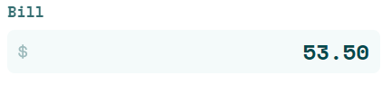
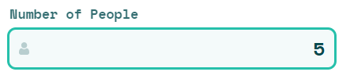
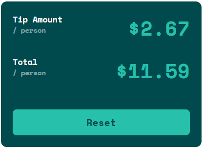
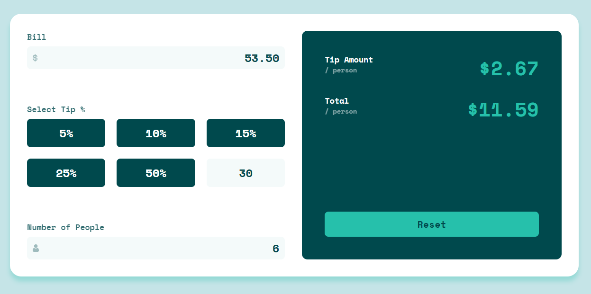
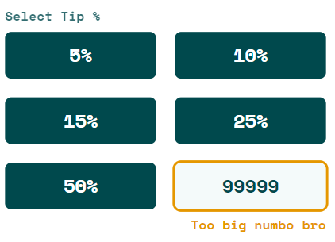
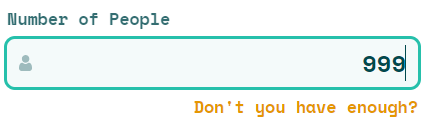
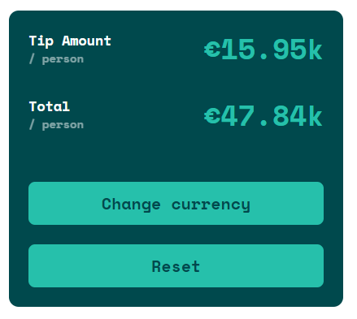
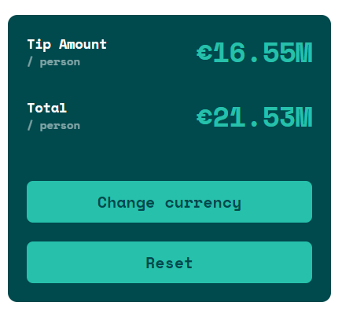

# Tip calculator app

## Table of contents

- [Summary](#summary)
- [Usage](#usage)
- [Built with](#built-with)
- [Live website](#live-website)
- [More insights](#more-insights)

## Summary

This project is a solution to the [Tip calculator app challenge on Frontend Mentor](https://www.frontendmentor.io/challenges/tip-calculator-app-ugJNGbJUX). The app allows to calculate:
+ tip amount
+ total bill value

based on three values:

+ bill value
+ tip percentage
+ number of people

**Mobile view:**

**Desktop view:**

## Usage

In order to calculate results, user must provide three values.

In the **Bill** section, enter the bill value, e.g.:

In the **Select Tip %** section, you can choose either predefined value by pressing the corresponding button:

or by passing the custom value, e.g.:

In the **Number Of People** section, enter the number of people who share the bill, e.g.:

If entered data are correct, **Tip amount/person** and **Total/person** values are calculated:

By pressing **Reset** button, you can restore the app to the initial state.

## Built with

- Semantic HTML5
- CSS + Flexbox
- Mobile-first workflow
- BEM naming convention
- RWD
- Vanilla JS

## Live website

[Here you can test live website](https://aviation4.github.io/Tip-calculator/)

## More Insights

### Inputs ###

All inputs are checked for data validity. When any of the entered values is incorrect, warning message is displayed and result values are set to zero.

The **Bill** value must be a positive number, not greater than 999 999. Typing the seventh digit is blocked:

Typing a letter is blocked:

Typing a comma is blocked:

Typing a dash/hyphen is blocked:

When entering custom tip value in **Select Tip %** section, the only acceptable characters are numbers. Entering any other character causes the warning message to be displayed. Maximum tip percentage is 9999:

When entering **Number Of People** value, the only acceptable characters are numbers. Entering any other character causes the warning message to be displayed. Maximum number is 999:

**As long as warning message is displayed, results are not calculated**

### Outputs ###

In order to fit into width of mobile devices, the result is displayed in the short form in some cases. When either **Tip amount** or **Total** value is *greater or equal to 1000 and lower than 1 000 000*, the result is expressed in thousands:

When either **Tip amount** or **Total** value is *greater than 1 000 000*, the result is expressed in millions:

Result value will not be greater than $101M, in accordance with input limitations.
