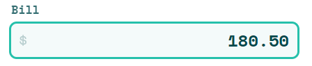
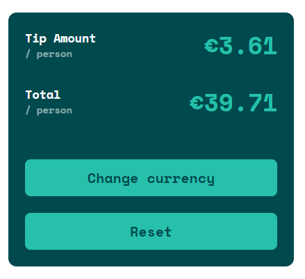

# Tip calculator app

This is a solution to the [Tip calculator app challenge on Frontend Mentor](https://www.frontendmentor.io/challenges/tip-calculator-app-ugJNGbJUX). The app allows to calculate:
+ tip amount
+ total bill value

based on three values:

+ bill value
+ tip percentage
+ number of people

**Mobile view**

**Desktop view**

## Table of contents

- [Usage](#usage)
- [Built with](#built-with)
- [Live website](#live-website)
- [More insights](#more-insights)

## Usage

In order to calculate results, you have to provide three values.

In **Bill** section, pass the bill value:

In **Select Tip %** section, you can choose predefined value by pressing corresponding key:

or pass custom value:

In **Number Of People** section, pass the number of people who will share the bill:

If entered data are correct, **Tip amount/person** and **Total/person** values will be calculated:

By pressing **Reset** button, you can restore the app to the initial state.

## Built with

- Semantic HTML5
- CSS + Flexbox
- Mobile-first workflow
- BEM naming convention
- Vanilla JS

## Live website

[Here you can test live website](https://aviation4.github.io/Tip-calculator/)

## More Insights

The bill value must be a positive number, no greater than 999 999. Trying to type seventh number is blocked:

Trying to type a letter is blocked:

Trying to type a comma is blocked:

Trying to type a dash/hyphen is blocked:

